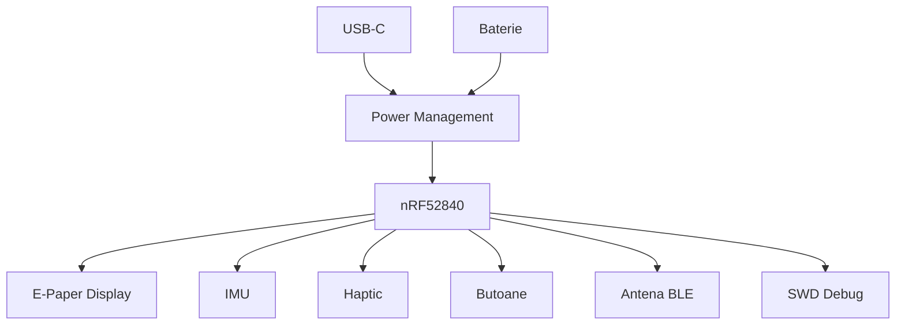

# InkTime

## Descriere

InkTime este un smartwatch bazat pe **nRF52840**. Proiectul include schema electrica, PCB-ul, modelul 3D al ansamblului si fisierele necesare pentru fabricatie.

## Diagrama bloc

## Functionalitate hardware

Placa este construita in jurul microcontrollerului **nRF52840**, care gestioneaza logica principala a sistemului, comunicatia BLE si interfatarea cu toate perifericele.

### Blocuri principale

- **nRF52840** - microcontroller principal
- **BQ25180** - incarcare baterie Li-Po si power management
- **RT6160** - convertor DC/DC pentru alimentarea sistemului
- **MAX17048** - monitorizare nivel baterie
- **BMA423** - senzor IMU
- **DRV2605** - driver pentru motorul haptic
- **USB-C + USBLC6** - alimentare si protectie ESD
- **conector e-paper** - interfata pentru display
- **SWD** - programare si depanare

### Componente principale si linkuri utile

| Componenta    | Link JLCPCB                                                                             | DATASHEET                                                                                                                |
| ------------- | --------------------------------------------------------------------------------------- | ------------------------------------------------------------------------------------------------------------------------ |
| nRF52840      | [JLCPCB](https://jlcpcb.com/partdetail/NordicSemicon-NRF52840_QIAAR7/C1851953)          | [Nordic Product Specification](https://docs.nordicsemi.com/bundle/nRF52840_PS_v1.10/resource/nRF52840_PS_v1.10.pdf)      |
| BQ25180YBGR   | [JLCPCB](https://jlcpcb.com/partdetail/TexasInstruments-BQ25180YBGR/C3682423)           | [TI BQ25180 datasheet](https://www.ti.com/lit/gpn/bq25180)                                                               |
| RT6160AWSC    | [JLCPCB](https://jlcpcb.com/partdetail/RichtekTech-RT6160AWSC/C7065276)                 | [Richtek RT6160A datasheet](https://www.richtek.com/assets/product_file/RT6160A/DS6160A-05.pdf)                          |
| MAX17048G+T10 | [JLCPCB](https://jlcpcb.com/partdetail/MaximIntegrated-MAX17048GT10/C2682616)           | [MAX17048/MAX17049 datasheet](https://www.analog.com/media/en/technical-documentation/data-sheets/max17048-max17049.pdf) |
| BMA423        | [JLCPCB](https://jlcpcb.com/partdetail/BoschSensortec-BMA423/C189517)                   | [BMA423 datasheet](Doc/BMA423_Rev2.0_Aug2019.pdf)                                                                        |
| DRV2605YZFR   | [JLCPCB](https://jlcpcb.com/partdetail/TexasInstruments-DRV2605YZFR/C81079)             | [TI DRV2605 datasheet](https://www.ti.com/lit/gpn/drv2605)                                                               |
| 2450AT18B100E | [JLCPCB](https://jlcpcb.com/partdetail/JohansonDielectrics-2450AT18B100E/C2917717)      | [Johanson antenna datasheet](https://www.johansontechnology.com/datasheets/2450AT18B100/2450AT18B100.pdf)                |
| USBLC6-2SC6Y  | [JLCPCB](https://jlcpcb.com/parts/componentSearch?isSearch=true&searchTxt=USBLC6-2SC6Y) | [ST USBLC6-2 datasheet](https://www.st.com/resource/en/datasheet/usblc6-2.pdf)                                           |
| KH-TYPE-C-16P | [JLCPCB](https://jlcpcb.com/partdetail/Shenzhen_KinghelmElec-KH_TYPE_C16P/C709357)      | [KH-TYPE-C-16P datasheet](https://en.sekorm.com/doc/3353320.html)                                                        |
| 5034802400    | [JLCPCB](https://jlcpcb.com/partdetail/MOLEX-5034802400/C122434)                        | [Molex 503480 series chart](https://www.molex.com/en-us/products/series-chart/503480)                                    |

### Interfete utilizate

- **BLE / RF** - comunicatie wireless prin nRF52840 si antena 2.4 GHz
- **USB** - prin pinii dedicati ai nRF52840
- **I2C** - pentru IMU, fuel gauge, driver haptic si circuite de management
- **SPI / control display** - pentru e-paper
- **GPIO** - butoane, semnale de control si intreruperi

## Consideratii de proiectare

La proiectarea PCB-ului au fost urmarite:

- amplasarea antenei la marginea placii
- decupare/keepout sub antena
- trasee de alimentare mai late decat traseele de semnal
- condensatoare de decuplare cat mai aproape de pinii de alimentare
- acces facil la SWD si test pad-uri
- integrarea mecanica a placii, bateriei, display-ului si motorului haptic in carcasa

